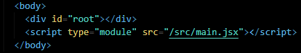
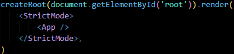

# 
 INTRODUCTION

### **WHAT IS REACT JS ?**  
Open source Js **library**,  

**Library**: You call function, like a toolbox you pick tools when needed    
**Framework**: It decides when your code runs, You follow its rules and structure

Developed by Facebook SDE **Jordan Walke** (2013),  
Got Open Sourced in 2015.   

React Native easily can be learnt after - for Mobile Apps

---

**HOW IT WORKS?**  
Creates virtual DOM  
Only changes what needs to be changed as previously, DOM used to refresh the whole webpage

---

React Project Essentials -
- Vite ?  
Recommended in Offical documentation  
Super fast dev server & Build tool
- NodeJs - LTS (Long term support)
- Npm, Bun can also be used instead of npm as 29x faster

---
   
### Our First React App

   Go to https://vite.dev/guide/ for steps
1. Open terminal and go to folder location.
2. `npm create vite@latest`
3. Will ask to name project,  
Select framework - react,  
Select variant - Javascript
4. `cd ProjectName` 
5. `npm install`  
All above steps will add needed files for the App.
6. `npm run dev`

Your project should now run on **localhost : 5173** (Vite’s default port).  
5173 ~ VITE

We can use online react too, Official Site  
https://stackblitz.com/edit/vitejs-vite-jzwmmfrr?file=index.html&terminal=dev

---

### 
 WorkFlow
index.html -> main.jsx -> App.jsx -> Other linked Components
1. index.html : untouched, had div root, every code inside it

   
2. main.jsx : Linking App.jsx, to root div by getElelementById('root')

   

2. App.jsx : Linking other components

---
### 
Updating Project to Latest Version
RC - Release Candidate : Almost ready for final release  

**TO CHECK CURRENT VERSION -**  
Open Project Folder -> Open Package.json -> Check Dependancies

**TO UPGRADE -**  
Either direct changes in dependencies or  
Open root folder in terminal  
Run `npm install react@rc react-dom@rc` 