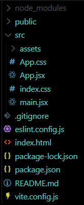

# Structure Of React Project

1. **Node_Modules Folder**  
   All libraries & Dependancies code  
   All behind the scenes stuff, not have to bother  
2. **Public Folder**  
   All statics assets - images/videos
3. **Src Folder**   
   Contains all source files.  
   3.1. Assets Folder ~ similar work like Public but restrictions  
   3.2. App.jsx - Basic Layout, Goes to Main.jsx file  
   3.3. Main.jsx - Imports App.jsx, links index.html  
   3.4. App.css  
   3.5. Index.css
4. **.eslintrc.cjs**  
   Static code analysis tool, ignore
5. **.gitignore**  
   If you don't want to add folder as a git repo
6. **index.html**  
   Main file where react app is loaded, **entry point** of browser
7. **package.json**  
   Configuration of libraries, dependancies
8. **package-lock.json**  
   Nested and more details comparison to package.json
9. **vite.config.js**
10. **eslint.config.js**
11. **.gitignore**

   