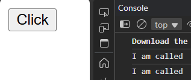
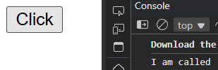
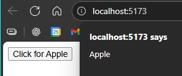

# <center>JSX
Syntax extension of Js, JavaScriptXML  
Let us write html in JavaScript and place them in the DOM ,  
JSX converts HTML tags into react elements.

---
**RULES**  
In JSX Camel case is used for eg  `onClick`  
Use `className` Instead of `class`  
JavaScript Expressions in `{curly braces}`  

---
## <center> FUNCTIONS
We have to **pass function definition** in curly braces, **Not just calling**

```jsx
const App = () => {

  function callme(){
    console.log("I am called")
  }

  return (
    <div>
      <button onClick={callme()}>Click</button>
    </div>
  )
}

export default App
```
  
Automatically ran without clicking

**Why it prints twice ?**  
When React sees this line, it executes callme() immediately — because of the parentheses.  
So before the button even appears on screen, your function runs once.

React runs in Strict Mode (Check main.jsx).  
Strict Mode intentionally calls your functions twice during render not in production, but only in development   
to help detect side effects and bugs.

**Why clicking doesn’t work anymore**   
Because you wrote `onClick={callme()}`, React receives the result of calling the function (which is undefined), not the function itself.
So effectively, React sees this:  
`<button onClick={undefined}>Click</button>`

---

**CORRECT METHOD -**
```jsx
<button onClick={callme}>Click</button>
```
  
Now React will store the function reference, and only execute it when you click.

---
**PASSING PARAMETERS -**
```jsx
const App = () => {

  const fruit = (name) => {
    alert(name)
  }

  return (
    <div>
      <button onClick={()=>fruit("Apple")}>Click for Apple</button>
    </div>
  )
}
```



## <center> - CURLY BRACES -

Hels us with variable, functions... and much more.
```jsx
function App() 
{
  const name = "Ayush"; //Variable

  function callFun(a,b){ //function
    return "Sum is "+(a+b)
  }

  const fruit = (name) =>{ //arrow to return
    alert(name)
  }

  const obj={ //object
    name: "Ayush",
    age: 21
  }

  // Using Everything created above
  return (
    <>
      <h3>{name}</h3>
      {callFun(60,9)}
      <button onClick = {()=>fruit("Apple")}> Click Here </button>
      {obj.name}
    </>
  )
}

export default App
```
