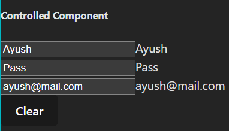

# CONTROLLED COMPONENT
A form + whose input field value is controlled by react state  
If not controlled by react state => Uncontrolled component


**HOW IT WORKS ?**  
- Store input field value in state  
- Use change handler with input field  
- Value attribute attached with state

---
For eg:-
```jsx
<input type="text" onChange={(event)=>setName(event.target.value)}/>  

{name}
```
---

```jsx
import { useState } from "react"

function App(){

  const [name, setName] = useState('');
  const [password, setPassword] = useState('');
  const [mail, setMail] = useState('');

  return(
    <>
      <h5>Controlled Component</h5>

      <form action="">
        <input type="text" value={name} onChange={(event)=>setName(event.target.value)}/>
        {name}
        <br />
        <input type="text" value={password} onChange={(event)=>setPassword(event.target.value)}/>
        {password}
        <br />
        <input type="text" value={mail} onChange={(event)=>setMail(event.target.value)}/>
        {mail}
        <br />
        <button onClick={()=>{setName('');setMail('');setPassword('')}}>Clear</button>
        
      </form>
    </>
  )
}

export default App
```


---
**BENIFITS**  
- Single source of truth
- Validation and Manipulation before submit
- Dynamic updates values