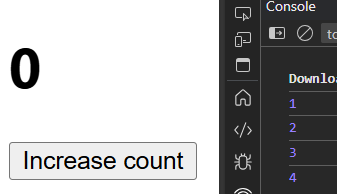
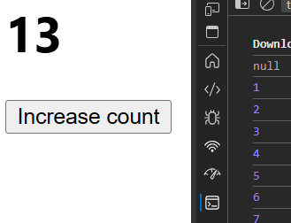
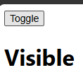
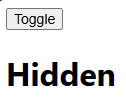

# useState

**STATE** ?  
Same as variable to store data, Re-renders automatically. 

---

```jsx
//Let's use variable

const App = () => {
  let count=0;

  return (
    <>
      <h1>{count}</h1>

      <button onClick={()=>{
        count++;
        console.log(count)
      }}>Increase count</button>

    </>
  )
}
export default App
```
 count only changes in backgound

---
```js
//Using state

import React, { useState } from 'react'

const App = () => {

  let [count, setCount] = useState(null)

  return (
    <>

      <h1>{count}</h1>

      <button onClick={()=>{
        setCount(count+1)
        console.log(count)
      }}>Increase count</button>

    </>
  )
}
 
export default App
```


---
# <CENTER> TOGGLE HIDE/SHOW

```js
import React, { useState } from 'react'

const App = () => {

  const [display, setDisplay] = useState(true)

  return (
    <>
      <button onClick={()=>setDisplay(!display)}>Toggle</button>
      {
        display ? <h1>Visible</h1> : <h1>Hidden</h1>
      }
    </>
  )
}
```

 