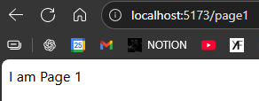
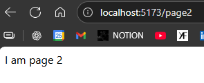

# REACT ROUTER

**WHAT ?**  
To make pages for different URLs

Official Website : https://reactrouter.com/home   
Latest version 7.9.5  

It has both framework & Library options to setup.  
Better to go with library for reactjs

---
SETUP :-

    npm i react-router

```jsx
//main.jsx

import { BrowserRouter } from 'react-router' //import
..
..
  <BrowserRouter>  //wrap
    <StrictMode>
      <App />
    </StrictMode>,
  </BrowserRouter>
..
// You can remove <StrictMode> too
```
---
### <center> DEMO

```jsx
//App.jsx

import {Routes, Route} from 'react-router'
import Page1 from './Page1'
import Page2 from './Page2'

const App = () => {
  return (
    <>
      <Routes>
        <Route path="/page1" element={<Page1/>} />
        <Route path="/page2" element={<Page2/>} />
      </Routes>
    </>
  )
}

export default App
```


---


### <CENTER>THEORY

**1. BrowserRouter ?**  
A Component that Enables, client side routing (Path changes but page doesn't refresh), using **browser history** API.  
We have to create wrapper of BrowserRouter to use it.

**2. Routes ?**  
Tells which page on which Route(URL)

**3. Route ?**  
Makes a component as a page  
```jsx
<Routes>
  < Route path='/' element = { <App/> }
</Routes>
```

---
### Link ?
`<Link to='/'> Click here </Link>`