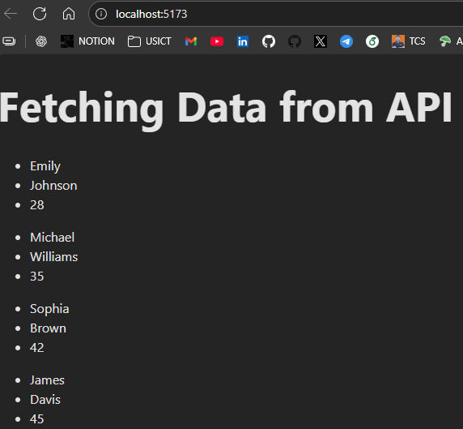

# API
Application programming interface.  

- We need data from database, js can't connect via database coz  
Js is client side scripting language where as dataBase is server side scripting language

Api is made via languages like PHP, java, python that can fetch data from database

API is Json data

---

## <CENTER> API METHODS
- GET : Fetch data from api
- POST : To store some data
- PUT/PATCH : To update data
- DELETE : To delete data
---

We will be given link of API, we have to first test that API  
Either via PostMan or Thunder Client

Paste link of json in thunderclient and send  
=> if status code = ok  
=> fine

---

```jsx
import { useEffect } from "react"
import { useState } from "react";

function App() {
 
  const [userData, setUserData] = useState([]);

  useEffect(()=>{
    getUserData();
  },[])

  // Function to call API, time taking hence async
  async function getUserData(){
    const url = "https://dummyjson.com/users";

    let response = await fetch(url); //fetch to req from API, time taking hence await
    response = await response.json();
    
    setUserData(response.users); //.users to access users column
  }
  
  console.log(userData);

  return (
    <div>
      <h1>Fetching Data from API</h1>
      
      // Block to recieve API data 
      {
        userData && userData.map((user)=>(
          <ul>
            <li>{user.firstName}</li>
            <li>{user.lastName}</li>
            <li>{user.age}</li>
          </ul>
        ))
      }

    </div>
  )
}

export default App

```



---

# <center> JSON SERVER
For making custom API  

Why not to make one using python/jave using database  
=> Time Consuming

https://github.com/typicode/json-server

    npm install json-server

create `fileName.json`

```js
{
    "users":[
        {
            "Name":"Ayush",
            "Age":22,
            "Email":"ayush@.com"
        },
        {
            "Name":"Aditi",
            "Age":22,
            "Email":"aditi@.com"
        }
    ]
}
```

     npx json-server fileName.json