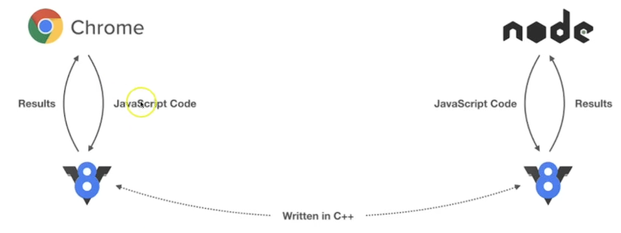

# <center> Node Js Introduction

**WHAT ?**  
Open source, cross platform, runtime evironment for executing js code outside browser.  
Earlier Js was only used in browser and that too only for frontend tasks like validation, DOM manipulation.  



---
#### <center>CLIENT SIDE VS SERVER SIDE SCRIPTING LANGUAGE ?
### 1. Client-Side Scripting  
Code runs on user’s browser (js)  
Used for:
UI interactions, Form validation, DOM manipulation
**Limitations**: Cannot directly access: Databases, File systems, Server resources

### 2. Server-Side Scripting

Code runs on the server,  
eg: PHP, Java, Python, Js (using Node.js)  
These Can: Connect to databases, Access file systems, Handle authentication, Create APIs

---
### How Node.js Changes JavaScript ?

Node.js converts JavaScript into a server-side scripting language by providing: Runtime environment & Built-in modules (fs, http, path, etc.)

Now JavaScript can: Run outside browser, Act as backend language, Handle requests & responses

---
**INSTALLATION ?**  
Go to https://nodejs.org/en -> Download LTS  
Node and npm will get installed

Documentation : https://nodejs.org/docs/latest/api/

---
## <center>STARTING WITH OUR PROJECT

    npm init

will add customised `package.json` in our project


---
TO RUN OUR JS FILE  

    node fileName

---
In react like we just have to write `npm run dev`  
No need to mention specific file name, here too we can  
by changing script in dependencies
```json
{
  "scripts": {
    "test": "echo \"Error: no test specified\" && exit 1"
  },
}
// Chnage above code to
{
  "scripts": {
    "dev": "node fileName.js"
  },
}
```
Now if we write `npm run dev` => it will run `node fileName.js`

---


#### <CENTER>NODEMON
If we use `node fileName.js`, it doesn't show changes if made in code, we have to restart server after every change.  

    npm i nodemon -g //installing globally
    
    nodemon fileName.js

This will auto reload server if changes are made