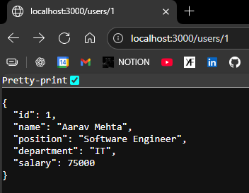

Since we dont have database rn, let's use array :-
```js
import express from 'express'
const app = express()

let users = [
  {
    "id": 1,
    "name": "Aarav Mehta",
    "position": "Software Engineer",
    "department": "IT",
    "salary": 75000
  },
  {
    "id": 2,
    "name": "Neha Sharma",
    "position": "HR Manager",
    "department": "Human Resources",
    "salary": 65000
  },
  {
    "id": 3,
    "name": "Rohan Gupta",
    "position": "Data Analyst",
    "department": "Analytics",
    "salary": 72000
  },
  {
    "id": 4,
    "name": "Simran Kaur",
    "position": "Marketing Specialist",
    "department": "Marketing",
    "salary": 68000
  },
  {
    "id": 5,
    "name": "Aditya Verma",
    "position": "Team Lead",
    "department": "Development",
    "salary": 90000
  }
]

app.get('/users', (req, res)=>{
    res.json(users)
})

app.listen(3000, ()=>{
    console.log("Server Started");
})
```

---

# <center> Request Parameters ?
Dynamic routing,   
after **:** in our URL, is treated as variable

```js
app.get('/users/:cid', (req, res)=> //cid is variable
{
    let cid = req.params.cid //Now id will store value from URL 
    
    //Checking if that id is present above in array 
    let existingUser = users.find((it)=>(it.cid==id))
    
    if(!existingUser){
        return res.send("404 Not Found")
    }

    res.json(existingUser)
})
```

