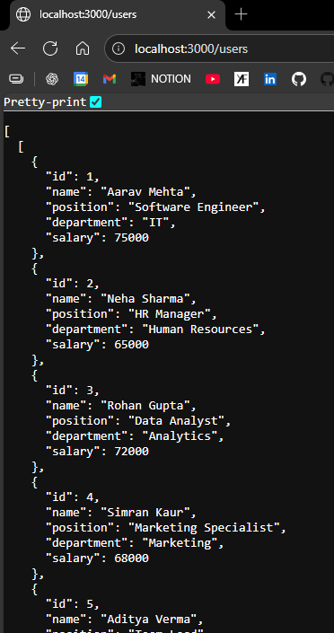

```js
import express from 'express'
const app = express()

//Since we dont have database rn
let users = [
  {
    "id": 1,
    "name": "Aarav Mehta",
    "position": "Software Engineer",
    "department": "IT",
    "salary": 75000
  },
  {
    "id": 2,
    "name": "Neha Sharma",
    "position": "HR Manager",
    "department": "Human Resources",
    "salary": 65000
  },
  {
    "id": 3,
    "name": "Rohan Gupta",
    "position": "Data Analyst",
    "department": "Analytics",
    "salary": 72000
  },
  {
    "id": 4,
    "name": "Simran Kaur",
    "position": "Marketing Specialist",
    "department": "Marketing",
    "salary": 68000
  },
  {
    "id": 5,
    "name": "Aditya Verma",
    "position": "Team Lead",
    "department": "Development",
    "salary": 90000
  }
]

app.get('/users', (req, res)=>{
    res.json(users)
})

app.listen(3000, ()=>{
    console.log("Server Started");
})
```



---

### <center> Request Parameters ?

```js
// Dynamic routing, after : it is treated as variable

app.get('/users/:id', (req, res)=>
{
    let id = req.params.id //Now id will store value from above 
    
    //Checking if that id is present above in array 
    let existingUser = users.find((it)=>(it.id==id))
    
    if(!existingUser){
        return res.send("404 Not Found")
    }

    res.json(existingUser)
})
```

