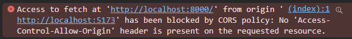
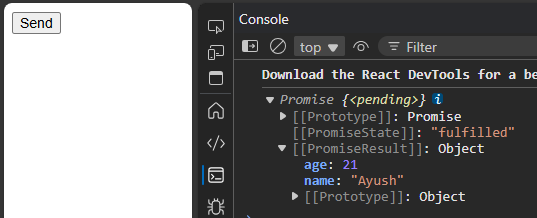
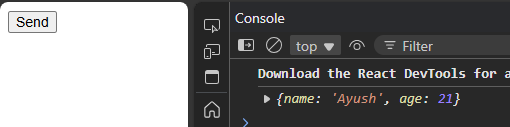

Let's connect our frontend with backend,  
Displaying backend data on frontend

```js
// app.jsx (frontend)
// localhost:8000 ie. backend stores {'name':"ayush", "age":21}  

const App = () => {

  //Fetching data from URL
  async function getRes() 
  {
    const res = await fetch("http://localhost:8000/")

    //Converting it into json format
    let data = await res.json();
    console.log(data);
  }

  return (
    <div>
      <button onClick={()=>getRes()}>Send</button>
    </div>
  )
} 

export default App
```

But on clicking button -> Error



## <center> CORS?
Cross origin resource sharing.  
A security feature in browser that prevents different requests from different origins unless explicitly allowed by the server.  
cors is also a middle ware.

`npm i cors`

```js
//Backend
import express from 'express'
import cors from 'cors'
let app = express();

app.use(cors())//Will allow everyone

app.get('/', (req, res)=>{
    res.json({
        name:"Ayush",
        age:21
    })
})

app.listen(8000, ()=>{
    console.log("Server started");
})
```
```jsx
//Frontend
function App() 
{
  async function getRes() {
    let res = await fetch("http://localhost:8000/")
    let data = res.json();
    console.log(data);
  }

  return (
    <div>
      <button onClick={()=>getRes()}>Send</button>
    </div>
  )
} 

export default App
```



### Using error handling

```jsx
async function getRes() {
    let res = await fetch("http://localhost:8000/")
    let data = res.json();
    // console.log(data);

    data.then((e)=>{
      console.log(e);
    })
    .catch((e)=>{
      console.log(e);
    })
}
```
