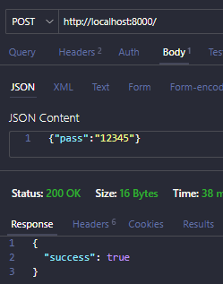

# MIDDLEWARE
Between client and server, request passes via middleware, it can either reject or approve the request.  


---
CUSTOM MIDDLEWARE

If middleware approves, it calls next function
```js
app.use((req, res, next)=>{
    next();
})
```

For eg : -
```js
import express from 'express'
const app = express();

let password = "ayush123"

app.use(express.json())

app.post("/", (req, res)=>{
    console.log(req.body) //data sent via thunderclient
    res.send({success:true})
})

app.listen(8000, ()=>{
    console.log("Server Started");
})
```
  


---
Lets use middle ware to use it as authenticator for pass

```js
import express from 'express'
const app = express();
app.use(express.json())

let password = "ayush123"

app.use((req, res, next)=>{
    if(req.body.pass!=password){
        res.send("Password not Matched")
    }
    next();
})

app.post("/", (req, res)=>{
    console.log(req.body) //data sent via thunderclient
    res.send({success:true})
})

app.listen(8000, ()=>{
    console.log("Server Started");
})
```


---

### <center> STATUS CODE?
1. **(100-199)** : Informational Responses
2. **(200-299)** : Successful Responses
3. **(300-399)** : Redirection Messages
4. **(400-499)** : Client Error Responses
5. **(500-599)** : Server Error Responses

Customised status
```js
app.post("/", (req, res)=>{
    console.log(req.body) //data sent via thunderclient
    res.status(269).send({success:true})
})
```


---
### Http Headers
Key Value pairs used in http requests & responses to pass additional info
1. Request Headers
Sent by client to server

2. Response Headers
By server to client