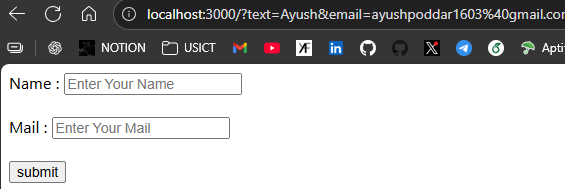
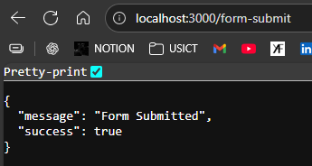

```html
<!-- index.ejs -->
<body>
    <form action="">
        Name : <input type="text" name="text" placeholder="Enter Your Name"><br><br>
        Mail : <input type="email" name="email" placeholder="Enter Your Mail"><br><br>
        <input type="submit" value="submit">
    </form>
</body>
```


Issue is you can see data sent on the address bar

---
```html
<body>
    <form action="/form-submit" method="POST">
        Name : <input type="text" name="text" placeholder="Enter Your Name"><br><br>
        Mail : <input type="email" name="email" placeholder="Enter Your Mail"><br><br>
        <input type="submit" value="submit">
    </form>
</body>
```
```js
import express from 'express'
const app = express();

app.use(express.urlencoded({extended:true}))

app.get('/', (req, res)=>{
    res.render('index.ejs')
})

//Using Post
app.post('/form-submit', (req, res)=>{
    res.json({
        message: 'Form Submitted',
        success: true
    })
})

const port = 3000;
app.listen(port, ()=>console.log(`Server started on port ${port}`));
```

Now on clicking submit button you will recieve 

