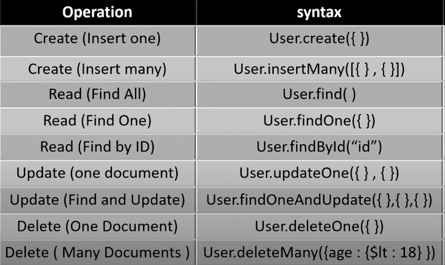
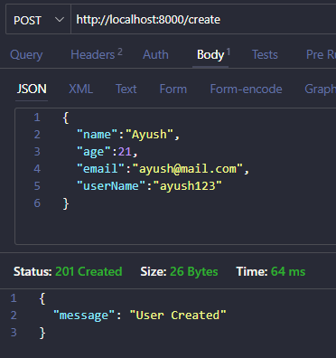
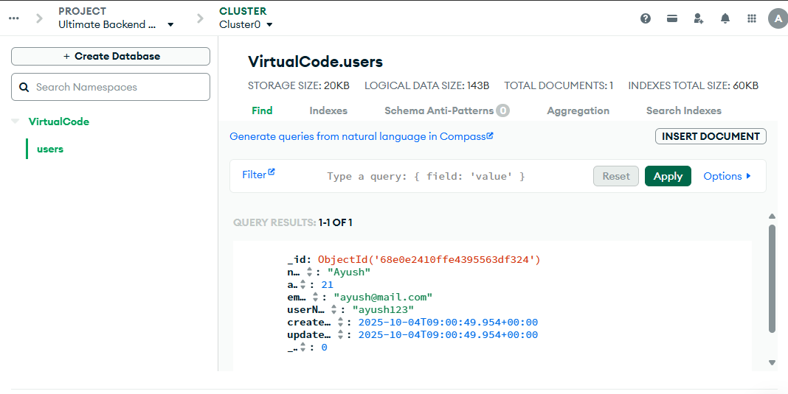
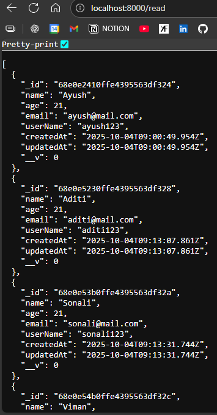
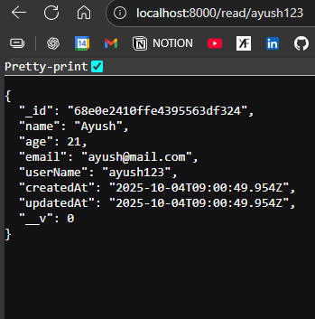
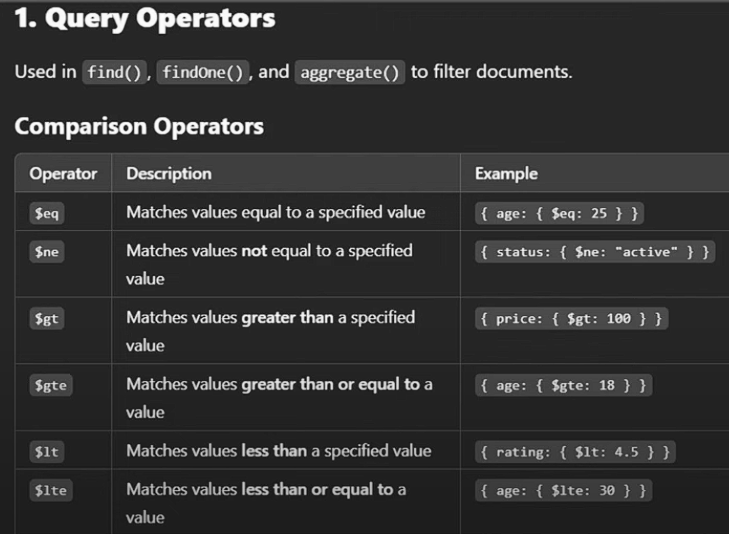
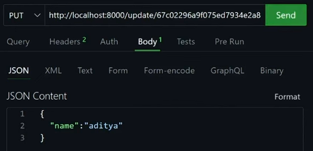

CHANGE ACCESS PERMISSON  
Go to your IP Access list, Delete pre existing, Add new and allow access to everyone

---
**SCHEMA ?**  
Defines structure of document (Single Record)

**MODEL ?**  
Wrapper around a MongoDB collection that gives you an interface to interact with your data

---
### <center> OPERATIONS ON DATABASE USING SERVER


```js
//user.model.js file

import mongoose from "mongoose";

//Designing a schema
const userSchema = new mongoose.Schema({
    name:{
        type:String,
        required:true
    },
    age:{
        type:Number,
        required:true
    },
    email:{
        type:String,
        required:true,
        unique:true
    },
    userName:{
        type:String,
        required:true,
        unique:true
    }
},{timestamps:true})

//Creating a model
//const ModelName = mongoose.model("ModelName", SchemaName)
const User = mongoose.model("User", userSchema)

export default User;
```



## <center>CREATE
Open thunderclient -> Add URL -> Select POST -> Body


```js
//index.js
import User from './models/user.model.js';

app.post("/create", async(req, res)=>
{
    try {
        let {name, age, email, userName} = req.body

        const newUser = await User.create({ //Model.create({})
            name,
            age,
            email,
            userName
        })

        res.status(201).json({message:"User Created"})
        
    } 
    catch (error) {
        return res.status(400).json({message:error})
    }
})

```
Here Database created with name Virtual code, collection with users
We named it as User, but mongodb changes it to lower case with s/es



---
# <center>read

```js
//To retrieve all users at once
app.get('/read', async (req,res)=>{ //get is used
    try {
        const users = await User.find(); //retrieves all info
        return res.status(200).json(users); //sending in json
    } 
    catch (error) {
        return res.status(400).json({message:"User not found"})
    }
})
```


Retrieving a particular user, using query params :-
```js
app.get('/read/:var', async (req,res)=>{ 
    try {
        const users = await User.findOne({var:req.params.userName}); //findOne({})
        return res.status(200).json(users);
    } 
    catch (error) {
        return res.status(400).json({message:"User not found"})
    } 
})
```


CONDITIONS :- 


```js
const users = await User.find( {name:{$eq: "ayush"}} ); 
```

---
# UPDATE

```js
app.put('/update/:id', async (req,res)=>{ 
    try {
        let {name} = req.body;
        let id = req.params.id
        let user = await User.findByIdAndUpdate(id, {name}, {new:true})
        return res.status(200).json(user)
    } 
    catch (error) {
        return res.status(400).json({message:"User not found"})
    } 
})
```
---
# DELETE

```js
app.put('/delete/:id', async (req,res)=>{ 
    try {
        let id = req.params.id
        let user = await User.findByIdAndDelete(id)
        return res.status(200).json(user)
    } 
    catch (error) {
        return res.status(400).json({message:"User not found"})
    } 
})
```