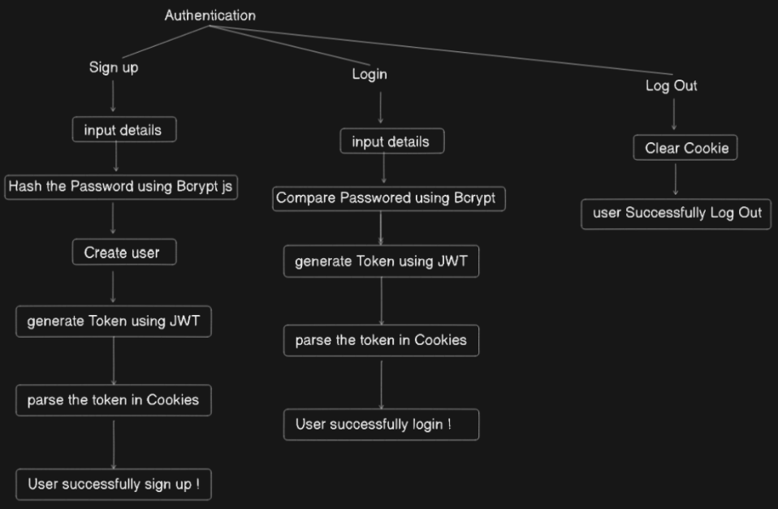
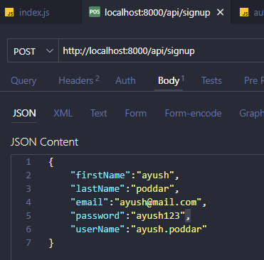
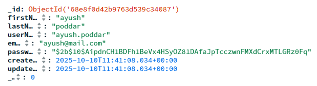
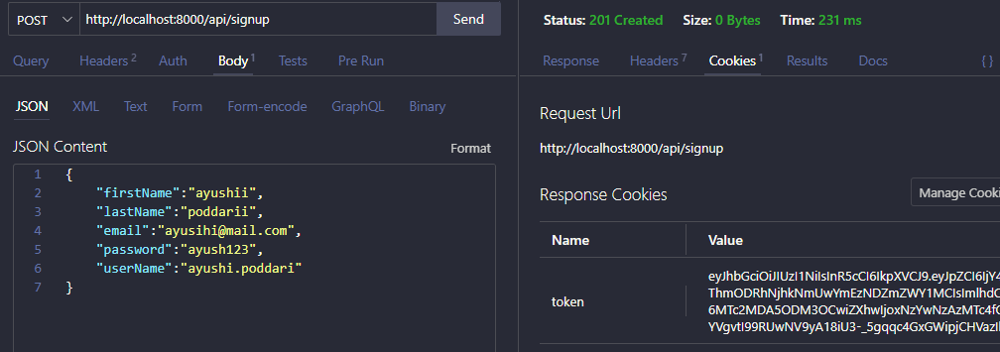

**AUTHENTICATION ?**  
Verifies who a user is ?

**AUTHORIZATION ?**  
Determines what a user can access



----

TOKEN ?  
Expiry date, will logout after that date  
Till then we will be logged in  
Generated usind JWT


COOKIE ?  
Checks the token

---
STEPS
1. Set up backend, npm init -y, type module
2. npm i express mongoose nodemon dotenv
3. config foler -> db.js -> Database connection
```js
import mongoose from "mongoose";

const connectDB = async() => {
    try {
        await mongoose.connect(process.env.MONGO_URL)
        console.log("DB Connected")
    } catch (error) {
        console.log("DB Error", error)
    }
}

export default connectDB;
```
```js
import express from 'express'
import dotenv from 'dotenv'
import connectDB from './config/db.js'
dotenv.config() //Used with dotenv

let app = express()
let port = process.env.PORT || 4000

app.listen(port, ()=>{
    connectDB() //To connect Db, from db.js file and config folder
    console.log(`Server started on ${port}`);
})
```
Our data base is connect uptill here

4. Creating schema & model -> models folder -> user.model.js
```js
import mongoose from "mongoose";

//Let's design schema first
const userSchema = new mongoose.Schema({
    firstName:{
        type: String,
        required: true
    },
    lastName:{
        type: String,
        required: true
    },
    userName:{
        type: String,
        required: true,
        unique:true
    },
    email:{
        type: String,
        required: true,
        unique:true
    },
    password:{
        type: String,
        required: true
    },
    profileImage:{
        type: String,
        required: false
    }
},{timestamps:true})

//After schema making model

const User = mongoose.model("User", userSchema) //In mongoDb it will be reflected as users
export default User;
```
5. Create routes foleder -> auth.routes.js
```js
import express, { Router } from 'express'
import { signup } from '../controllers/auth.controllers.js'

const authRouter = express(Router)

authRouter.post('/signup', signup)

export default authRouter
```

6. Create controllers folder -> auth.controllers.js -> Functions for routes like signup above
```js
import User from '../models/user.model.js'

export const signup = async(req, res) => {
    try {
        const {firstName, lastName, userName, email, password} = req.body

        // Checking if user already present or not
        let existUser = await User.findOne({email:email})
        if(existUser){
            return res.status(400).json({message:"User already exists"})
        }

        //Protecting our pass to be saved as raw in DB


    } catch (error) {
        return res.status(500).json({message:"Internal server error"})
    }
}
```
7. npm i bcryptjs
```js
const hassedPassword = await bcrypt.hash(password,10)
```
8. Creating a user
```js
// Creating a user
const user = await User.create({
    firstName, 
    lastName, 
    userName, 
    email, 
    password: hassedPassword
})
```

Checking data that has been sent

```js
return res.status(201).json({user:{
    firstName, 
    lastName, 
    userName, 
    email
}})
```



9. Creating a token

    npm i jsonwebtoken

Since we will use token for login, signin, and much more, will create it in config->token.js

```js
import jwt from "jsonwebtoken"

const generateToken = (id) => {
    let token = jwt.sign({id}, process.env.JWT_SECRET,
    {expiresIn:"7d"})
    return token;
}

export default generateToken
```

10. Parsing cookie
```js
//Generating a token
let token;
try {
    token = generateToken(user._id)
} catch (error) {
    console.log(error)
}

//Parsing token in cookie
res.cookie("token", token, {
    httpOnly:true,
    secure:process.env.NODE_ENVIRONMENT=="production",
    sameSite:"strict",
    maxAge:7*24*60*60*1000
})
```

npm i cookie-parser




---

# login

```js
export const login = async(req, res)=>{
    try {
        const {email, password} = req.body

        //Checking if exists
        let existUser = await User.findOne({email})
        if(!existUser){
            return res.status(400).json({message:"User doesnot exists"})
        }
        
        //Checking password
        let match = bcrypt.compare(password, existUser.password)
        if(!match){
            return res.status(400).json({message:"Incorrect Password"})
        }

        //Generating a token
        let token;
        try {
            token = generateToken(existUser._id)
        } catch (error) {
            console.log(error)
        }
        
        //Parsing token in cookie
        res.cookie("token", token, {
            httpOnly:true,
            secure:process.env.NODE_ENVIRONMENT=="production",
            sameSite:"strict",
            maxAge:7*24*60*60*1000
        })
        // //Checking
        // return res.status(200).json({user:{
        //     firstName:existUser.firstName, 
        //     lastName:existUser.lastName, 
        //     userName:existUser.userName, 
        //     email:existUser.email
        // }})
        

    } catch (error) {
        return res.status(500).json(error)
    }
}
```

----
# logout
```js
export const logout = async(req, res)=>{
    try {
        res.clearCookie("token") //token in cookie name
        return res.status(200).json({message:"Successfully logout"})
    } catch (error) {
        return res.status(500).json(error)
    }
}
```