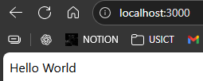

# EXPRESS JS ?
It is a npm package, so setup same as any other package

    npm i express

```js
//Express is imported using require
const express = require('express');

//An app instance is created 
const app = express();

//A route is defined, which responds with a message when the root URL (/) is accessed
app.get('/',(req, res)=>{
    res.send('Hello World');
})

//Starts the server and listens on port 3000 for incoming requests.
app.listen(3000)
```



---
# <center> WHY ?
Node.js framework that sits on top of Node.js, used to build web apps & APIs.