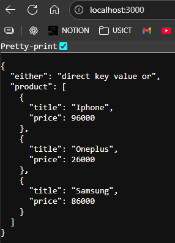
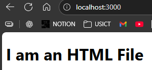

# <center> Sending JSON

```js
import express from 'express'
const app = express();

const products = [
    {title: 'Iphone', price: 96000},
    {title: 'Oneplus', price: 26000},
    {title: 'Samsung', price: 86000},
]

app.get('/', (req, res)=>{
    res.json({
        either : "direct key value or",
        product: products
    })
})

const port = 3000;

app.listen(port, ()=>console.log(`Server started on port ${port}`));


```



# <center>Sending HTML
We need absolute path to send html file.

```js
import express from 'express'
import path from 'path'
const app = express();

const fullPath = path.resolve();
const URL = path.join(fullPath,'./index.html')

app.get('/', (req, res)=>{
    res.sendFile(URL);
})

const port = 3000;

app.listen(port, ()=>console.log(`Server started on port ${port}`));
```

