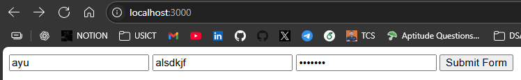
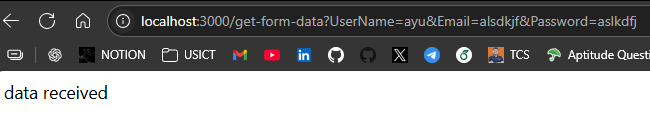
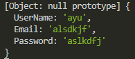
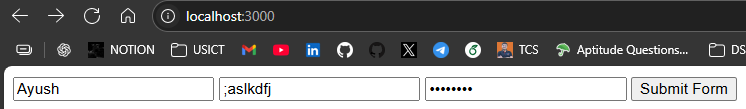
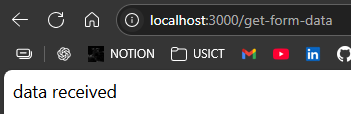
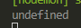
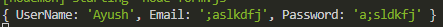

```html
<!-- index.ejs -->
<!DOCTYPE html>
<html lang="en">
<head><title>Document</title></head>
<body>
    <form action="/get-form-data"> //route
        <input 
            type="text"
            placeholder="Enter UserName"
            name="UserName" //name to display with obj
        >
        <input 
            type="text"
            placeholder="Enter Email"
            name="Email"
        >
        <input 
            type="password"
            placeholder="Enter password"
            name="Password"
        >
        <button>Submit Form</button>
    </form>
</body>
</html>
```
```js
const express = require('express');
const app = express();

app.set('view engine', 'ejs');

app.get('/', (req, res)=>{
    res.render('index');
})

app.get('/get-form-data', (req,res)=>{
    console.log(req.query);
    res.send('data received')
})

app.listen(3000);
```


---

---
But using get will display all data on url, therefore we use post

POST : Frontend -> server  
GET : VIce versa

---
Where all we need to make changes

```html
<form action="/get-form-data" method="post">
```
```js
app.post('/get-form-data', (req,res)=>{
    console.log(req.body);
    res.send('data received')
})
```

  


---

To see data inside undefined use
```js
//use built in middlewares
app.use(express.json())
app.use(express.urlencoded({extended:true}))
```

