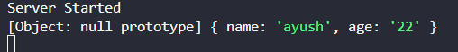

### Request Query
- req.query is an object that stores query parameters from the URL.
- Query Parameter are sent as key-value pairs in the **URL after the ?** Symbol and are typically used for filtering , searching etc.

```js
app.get('/search', (req, res)=>{
    res.send("Hello")

    console.log(req.query) //Check output

})
```
 

