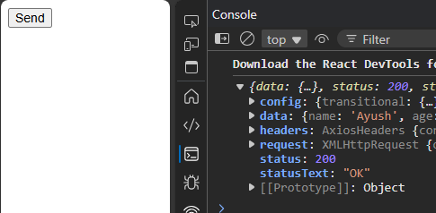

```jsx
import React from 'react'
import axios from 'axios'

function App() {

  async function getRes() {
    axios.get("http://localhost:8000/")
    .then((e)=>{
      console.log(e);
    })
    .catch((e)=>{
      console.log(e);
    })
  }

  return (
    <div>
      <button onClick={()=>getRes()}>Send</button>
    </div>
  )
} 

export default App
```



### CORS Particular request
