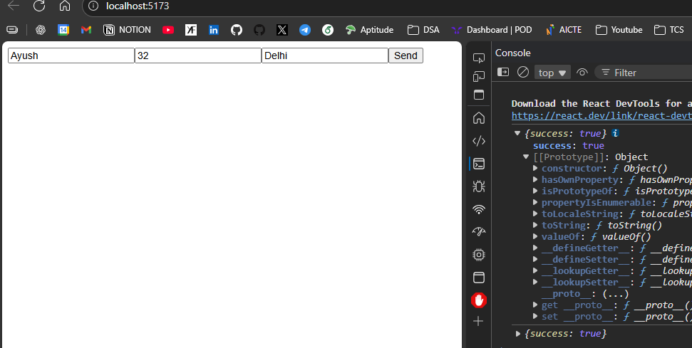
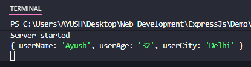

### <CENTER> FRONTEND
```JSX
import axios from "axios";
import { useState } from "react";

function App() {

  let [userName, setUserName] = useState("")
  let [userAge, setUserAge] = useState("")
  let [userCity, setUserCity] = useState("")

  async function getRes(){
    //Sending data to backend
    axios.post("http://localhost:8000/", {
      userName: userName,
      userAge: userAge,
      userCity: userCity
      /* Sent object will look like
       {
          "userName": "Ayush",
          "userAge": "21",
          "userCity": "Delhi"
        }
      */
    })
    .then((res)=>{
      console.log(res.data)
    })
    .catch((e)=>{
      console.log(e)
    })
  }

  return (
    <div>
      <input type="text" placeholder="Username" value={userName} onChange={(e)=>setUserName(e.target.value)} />
      <input type="text" placeholder="Age" value={userAge} onChange={(e)=>setUserAge(e.target.value)}/>
      <input type="text" placeholder="City" value={userCity} onChange={(e)=>setUserCity(e.target.value)}/>
      <button onClick={getRes}>Send</button>
    </div>
  );
}

export default App;
```



---
### <CENTER>BACKEND
```JS
import express from 'express'
import cors from 'cors'
let app = express();

app.use(cors({
    "origin":"http://localhost:5173"
}))

app.use(express.json())

app.get('/', (req, res)=>{
    res.json({
        name:"Ayush",
        age:21
    })
})

app.post('/', (req, res)=>{
    res.send({success:true}) //sending it to front end as response
    console.log(req.body)
})

app.listen(8000, ()=>{
    console.log("Server started");
})
```
