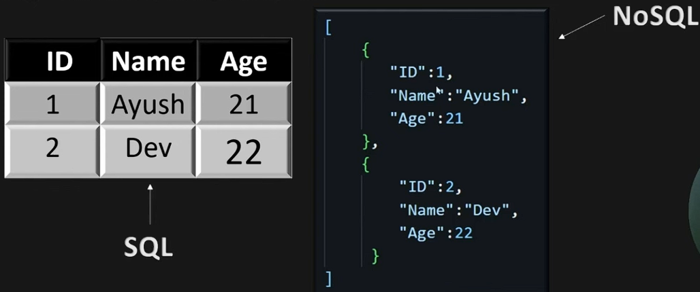
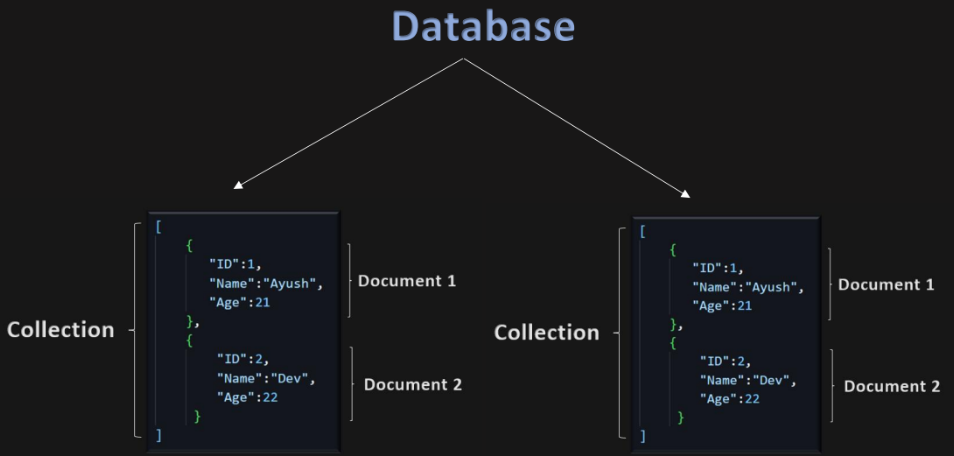
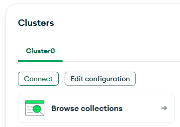

# <center> INTRODUCTION

**TYPES OF DATABASE ?**
1. SQL DB : MySQL, PostgreSQL
2. NoSQL : MongoDB

---
### <center> MONGODB ?
NoSQL db that stores data in JSON like format.

  

CLUSTER : Entire MongoDB deployment  
DATABASE : Container inside cluster  
COLLECTION : Table inside  
DOCUMENT : Single record of data in BJSON format  



Two ways - Offline S/W & Online(Recommended)

---
## ATLAS (Online Cloud Version) Industry Level

Go to official website -> Products -> Atlas  
https://www.mongodb.com/products/platform  

**MONGOOSE ?**
Library that connects mongodb & our backend

1. Setup mongoDB
2. Install mongoose
3. Connect Db with our server
4. Design schema
5. Create model based on schema to perform CRUD operations.

Detailed Steps -
1. Create new project on mongoDB & fill details https://cloud.mongodb.com/v2#/org/68a96e411b63e343cdf6d4e0/projects
2. Setup Express Server & Install mongoose `npm i mongoose`
3. Connecting our Db with server
-> Click create cluster, Fill details, click create deployment
-> It will generate username and password
-> Below click Create database user  
-> Click Choose a connection method  
-> mongoDB for Vs Code  
-> U'll recieve a sensitive string that we will use to connect DB and server.
msdfasfdasdfasdfasfgsde

```js
// index.js
import express from 'express'
import mongoose from 'mongoose';
const app = express();
const port = 8000;

//string from mongoDB
const mongoURL="msdfasfdasdfasdfasfgsde/DBNAME"

const connectDb = async()=>{
    try {
        await mongoose.connect(mongoURL); //mongoose.connect
        console.log("DB Connected") //on our vs code
    } catch (error) {
        console.log("Error ", error)
    }
} 

app.get('/',(req, res)=>{
    res.send("Hello");
})

app.listen(port, ()=>{
    connectDb() //That above function is called
    console.log(`Server started on ${port}`) //on our vs code
})
```
To check what databases are present in your collection  
click brows collections

