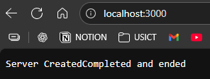

# Creating a Server

```js
//http package came pre with node
const http = require('http')

//createServer is a method that returns an instance
const server = http.createServer((req, res)=>{
    res.write("Server Created")
    res.end('Completed and ended')
})

//to run server
server.listen(3000)

```
Port ?  Entry/exit point for data  
Search for `localhost:3000` on browser


---

`res.write()` - Write data to response  
`res.end()`   - End response (can send data) 
