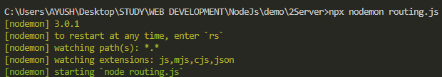

# ROUTING
```js
const http = require('http')

const server = http.createServer((req, res)=>{
    console.log(req.url);
}) 

server.listen(3000)
```

The URL i.e. being requested on search bar, They will appear here -


---


### Coustom routing
```js
const server = http.createServer((req, res)=>{
    if(req.url=="/about")
        req.end("I am about page")    
    if(req.url=="/profile")
        req.end("I am profile page")
})
```

## <CENTER>NODEMON
If we use `node fileName.js`, it doesn't show changes, we have to restart after every change.  

    npm i nodemon -g //installing globally
    
`nodemon fileName.js`

This will auto reload server on changes
