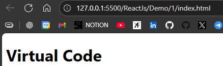

# <CENTER> INTRODUCTION

**WHAT IS REACT ?**  
Open source Js **library**,  
Developed by Facebook SDE **Jordan Walke** (2013),  
Got Open Sourced in 2015.   


React Native easily can be learnt after - for Mobile Apps

**HOW IT WORKS?**  
Creates virtual DOM  
Only changes what needs to be changed as previously, DOM used to refresh the whole webpage

---
### JS vs React
```js
//Using Js

//index.html
<!DOCTYPE html>
<html lang="en">
<head>
    <title>Document</title>
</head>
<body>
    <div id="root"></div>
    <script src="script.js"></script>
</body>
</html>

//script.js
let h1 = document.createElement("h1")
h1.innerHTML = "Virtual Code"
document.getElementById("root").appendChild(h1)
```


Now using react

```js

<body>
    <div id="root"></div>
    <!--Importing react via CDN-->
    <script crossorigin src= "https://unpkg.com/react@18/umd/react.development.js"></script>
    <script crossorigin src= "https://unpkg.com/react-dom@18/umd/react-dom.development.js"></script>

    <script src="script.js"></script>
</body>


//script.js
let h1 = React.createElement('h1', null, "Hello") //element created
ReactDOM.createRoot(document.getElementById("root")).render(h1)
// creating route to append above element in html
```


---
React Project Essentials -
- Vite  
Recommended in Offical documentation  
Super fast dev server & Build tool
- NodeJs - LTS (Long term support)
- Npm, Bun can also be used instead of npm as 29x faster

---
### Our First React App

   Go to https://vite.dev/guide/ for steps
1. Open terminal and go to folder location.
2. `npm create vite@latest`
3. Will ask to name project,  
Select framework - react,  
Select variant - Javascript
4. `cd ProjectName` 
5. `npm install`  
All above steps will add needed files for the App.
6. `npm run dev`

Your project should now run on **localhost : 5173** (Vite’s default port).  
5173 ~ VITE

---


### <center> WorkFlow
index.html -> main.jsx -> App.jsx -> Other linked Components
1. index.html : untouched
2. main.jsx : Linking App.jsx
3. App.jsx : Linking other components


---
### <CENTER>Updating Project to Latest Version
RC - Release Candidate : Almost ready for final release  

**TO CHECK CURRENT VERSION -**  
Open Project Folder -> Open Package.json -> Check Dependancies

**TO UPGRADE -**  
Either direct changes in dependencies or
Open root folder in terminal  
Run `npm install react@rc react-dom@rc` 