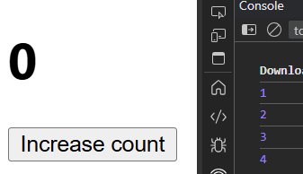
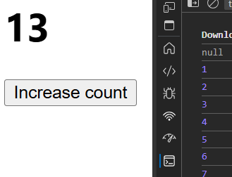

# useState

STATE ?  
Js object that holds data & info about a component.  

---

```jsx
const App = () => {
  let count=0;
  return (
    <>
      <h1>{count}</h1>
      <button onClick={()=>{
        count++;
        console.log(count)
      }}>Increase count</button>
    </>
  )
}
export default App
```



Only changes get done in backgound

---
```js
import React, { useState } from 'react'

const App = () => {
  let [count, setCount] = useState(null)
  return (
    <>
      <h1>{count}</h1>
      <button onClick={()=>{
        setCount(count+1)
        console.log(count)
      }}>Increase count</button>
    </>
  )
}
 
export default App
```

