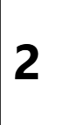
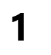
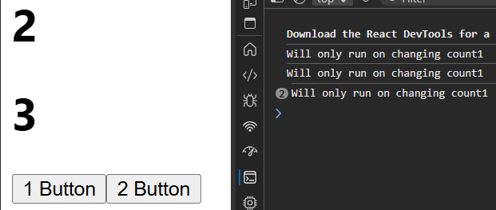

# <center>useEffect Hook

Allows you to perform side effects
- Fetching data
- Directly updating DOM elements
- Timers


---
SYNTAX -
`useEffect(<function>, <dependancy>)`  
When dependency changes, function run automatically

3 WAYS TO USE :-
  
## 1. No Dependency :  `useEffect(()=>{})`  
Will run everytime when any state changes
```jsx
import React, { useEffect, useState } from 'react'

const App = () => {
  let [count, setCount] = useState(0)

  useEffect(()=>{
    setTimeout(() => { //we changing state every second
      setCount(count+1)
    }, 1000);
  })

  return (
    <>
      <h1>{count}</h1>
    </>
  )
}
 
export default App
```
count keeps on increasing 


---


## 2. Only empty array : `useEffect(()=>{},[])`  
Will olny change once for any state change
```jsx
import React, { useEffect, useState } from 'react'

const App = () => {
  let [count, setCount] = useState(0)

  useEffect(()=>{
    setTimeout(() => {
      setCount(count+1)
    }, 1000);
  },[])

  return (
    <>
      <h1>{count}</h1>
    </>
  )
}
 
export default App
```

will only run once 

---

## 3. With state dependancy `useEffect(()=>{},[state])`  
Function will run when that specific state changes
```jsx
import React, { useEffect, useState } from 'react'

const App = () => {
  let [count1, setCount1] = useState(0)
  let [count2, setCount2] = useState(0)

  useEffect(()=>{
    console.log("Will only run on changing count1")
  },[count1])

  return (
    <>
      <h1>{count1}</h1>
      <h1>{count2}</h1>
      <button onClick={()=>setCount1(count1+1)}>1 Button</button>
      <button onClick={()=>setCount2(count2+1)}>2 Button</button>
    </>
  )
}
 
export default App
```

Will only console log when count1 changed 

---