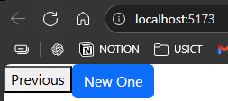
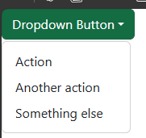

# BOOTSTRAP
Go to https://react-bootstrap.netlify.app/docs/getting-started/introduction

    npm install react-bootstrap bootstrap

This will add `bootstrap` and `react-bootstrap` in dependencies

```jsx
//in main.jsx
import 'bootstrap/dist/css/bootstrap.min.css';
```

```jsx
//App.jsx
import Button from 'react-bootstrap/Button';

function App(){
  return(
    <>
      <button>Previous</button>
      <Button>New One</Button>
    </>
  )
}

export default App;
```


More button variations : https://react-bootstrap.netlify.app/docs/components/buttons

---

Let's make a dropdown

```jsx
import Dropdown from 'react-bootstrap/Dropdown';

function App(){
  return(
    <>
      <Dropdown>
        <Dropdown.Toggle variant="success" id="dropdown-basic">
          Dropdown Button
        </Dropdown.Toggle>

        <Dropdown.Menu>
          <Dropdown.Item href="#/action-1">Action</Dropdown.Item>
          <Dropdown.Item href="#/action-2">Another action</Dropdown.Item>
          <Dropdown.Item href="#/action-3">Something else</Dropdown.Item>
        </Dropdown.Menu>
      </Dropdown>
    </>
  )
}

export default App;
```
