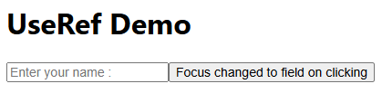
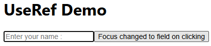
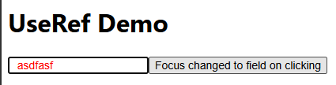

# useRef Hook

To control and manipulate HTML DOM

---
```jsx
import { useRef } from "react";

export default function App(){

  const inputRef = useRef(null);

  const inputHandler = () =>{
    inputRef.current.focus();
  }
  
  return(
    <div>
      <h1>UseRef Demo</h1>
      <input ref={inputRef} type="text" placeholder="Enter your name : "/>
      <button onClick={inputHandler}>Focus changed to field on clicking</button>
    </div>
  )
}
```
  
As we click on button placeholder highlights  


---
Inside inputHandler Function -  
`inputRef.current.style.color='red';`

