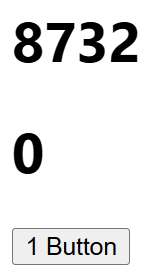

```jsx
import React, { useEffect, useRef, useState } from 'react'

const App = () => {
  let [count, setCount] = useState(0)
  let num = useRef(0);

  useEffect(()=>{
    setCount(count+1)
  })

  return (
    <>
      <h1>{count}</h1>
      <h1>{num.current}</h1>
      <button onClick={()=>setCount(count+1)}>1 Button</button>
    </>
  )
}
 
export default App
```
Keeps on infinite loop 

---
What if we want to render once

```jsx
import React, { useEffect, useRef, useState } from 'react'

const App = () => {
  let [count, setCount] = useState(0)
  let num = useRef(0);

  useEffect(()=>{
    num.current += 1
  })

  return (
    <>
      <h1>{count}</h1>
      <h1>{num.current}</h1> //This also gets changed on state change
      <button onClick={()=>setCount(count+1)}>1 Button</button>
    </>
  )
}
 
export default App
```

when button is pressed once
