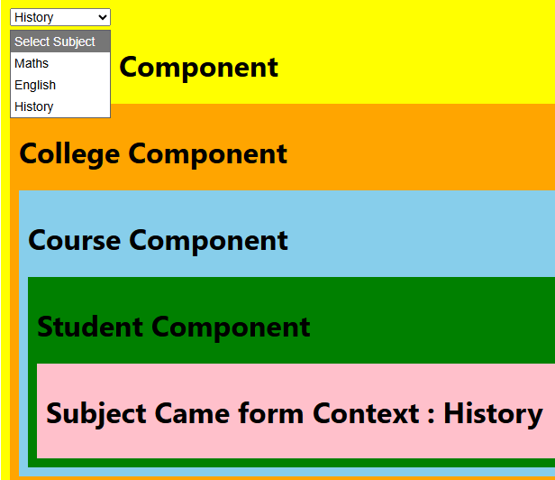

# CONTEXT API
Sharing of data without prop delay.

`createContext` : To initiate context API  
`Provider` : From where, Use to provide data  
`useContext` : To where, Get data from context API

```jsx
import {Context} from "./Context"
import College from "./College"
import { useState } from "react"

export default function App(){

  const [subject, setSubject] = useState('')
 
    return(
        <div style={{backgroundColor:'yellow', padding:10}}>

            <Context.Provider value={subject}>

              <select value={subject} onChange={(event)=>setSubject(event.target.value)}>
                <option value="">Select Subject</option>
                <option value="Maths">Maths</option>
                <option value="English">English</option>
                <option value="History">History</option>
              </select>

              <h1>University Component</h1>
              <College/>

            </Context.Provider>

        </div>
    ) 
}
```
