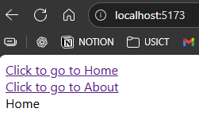

# ROUTER
Latest router version 7.8.2  
Official Website : https://reactrouter.com/home

To make pages

---

    npm i react-router

To check wheter working or not
in main.jsx

```jsx
import { BrowserRouter } from 'react-router'
..
..
  <BrowserRouter>  
    <StrictMode>
      <App />
    </StrictMode>,
  </BrowserRouter>
..
// You can remove strict mode too
```

Practical

```jsx
import { Routes, Route, Link } from "react-router"
import { Home } from "./Home"
import { About } from "./About"
 
 function App() {

  return (
    <div>
      
      <Link to='/'>Click to go to Home</Link> <br></br>
      <Link to='/about'>Click to go to About</Link>

      <Routes>
        <Route path='/' element={<Home/>} />
        <Route path='/about' element={<About/>}/>    
      </Routes>      

    </div>
  )
}

export default App
```



---
### BrowserRouter ?
Enables client side routing using browser history API
- Browser side routing : Path changes but leads to complete refresh of page, eg NASA 
- Client side routing : Path changes but page doesn't refresh

We have to create wrapper of BrowserRouter

---
### Routes ?
Tells which page on which path

---
### Route ?
Makes component as a page  
`<Route path='/  element={<App/>}`

---
### Link ?
`<Link to='/'> Click here </Link>`